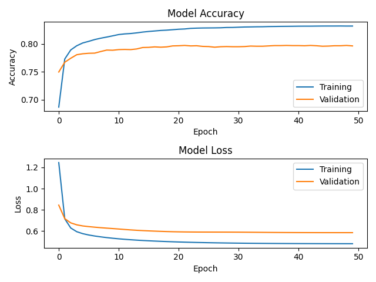

# Transfer learning with VGG19

This is a repository for demonstration on how to implement Transfer Learning with VGG19 model combine with Ensemble Learning for Real estate tagging problems

The dataset is pictures of 7 different classes: bathroom, bedroom, dining room, kitchen, living room, exterior, interior. This dataset is crawled from google.com

## Graphs

Current accuracy and loss, hyperparameters setting as in transfer_learning_vgg19.py (without Ensemble Learning):

## Dependencies
```
conda install -r requirements.txt
```

## Usage

Preprocessing data (your data must be placed in folder *Dataset* of *root*):
```
python preprocess.py
```

- Before trainning the model, please specify 2 hyperparameters: *trained_model_path* and *random_state*
- If train using a GPU, please follow the instruction in transfer_learning_vgg19.py

Example for training a model:
```
python transfer_learning_vgg19.py
```
- After training all the models is done, to test the accuracy of Ensemble Learning, add all your model paths as specify in ensemble_testing.py

Example for testing Ensemble Learning:
```
python ensemble_testing.py
```

## Author
Current author: [Tran Khanh Tung](https://github.com/KhanhTungTran)

## References
- [Transfer Learning in Keras with Computer Vision Models](https://machinelearningmastery.com/how-to-use-transfer-learning-when-developing-convolutional-neural-network-models/)
- [Transfer learning & fine-tuning](https://keras.io/guides/transfer_learning/)