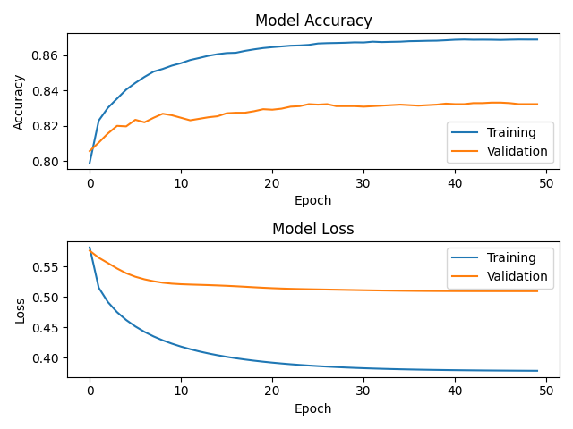

# Transfer learning Model

This is a repository for demonstration on how to implement Transfer Learning with pre-trained model for Real estate tagging problems.

The model is currently located at ~/rest_tagging on the Server.

The original dataset is pictures of 7 different classes: bathroom, bedroom, dining room, kitchen, living room, exterior, interior. This dataset is crawled from google.com.

## Graphs

Current accuracy and loss, hyperparameters setting as in transfer_learning_vgg19.py (without Ensemble Learning):


## Dependencies
```
pip install -r requirements.txt
```

## Usage

- Before trainning the model, please specify 2 hyperparameters: *trained_model_path* and data path
- Your data must be placed in folder *data* of *root*, you can change this in file *transfer_learning.py*
- If train using a GPU, please follow the instruction in transfer_learning_vgg19.py

Data directory structure:
```
data
├── train               # Training data, typically contains 80% of your data
|   ├── class1          # Images of the first class, for example: "ban cong"
|   ├── class2          # Images of the second class, for example: "phong ngu"
|   └── ... 
└── validation          # Validation data, typically contains the rest 20% of your data
    ├── class1          # Images of the first class, for example: "ban cong"
    ├── class2          # Images of the second class, for example: "phong ngu"
    └── ... 
```

Example for training a model:
```
python transfer_learning_vgg19.py
```

## Author
Current author: [Tran Khanh Tung](https://github.com/KhanhTungTran)

## References
- [Transfer Learning in Keras with Computer Vision Models](https://machinelearningmastery.com/how-to-use-transfer-learning-when-developing-convolutional-neural-network-models/)
- [Transfer learning & fine-tuning](https://keras.io/guides/transfer_learning/)
